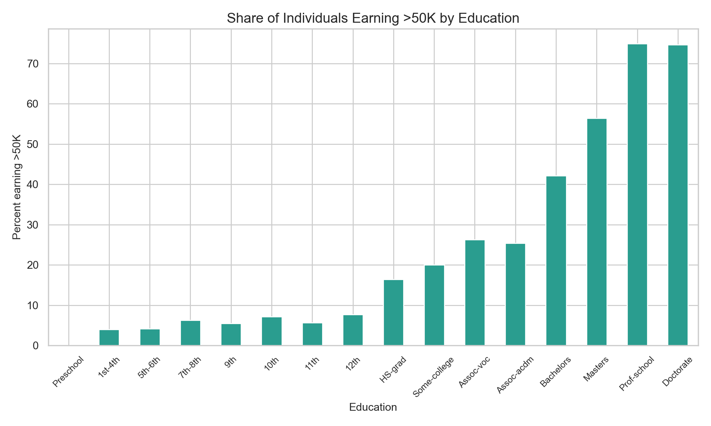
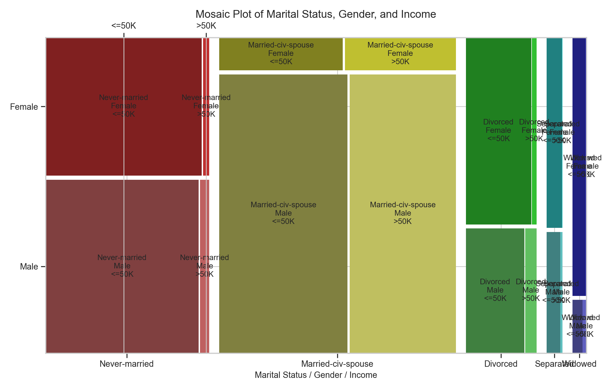
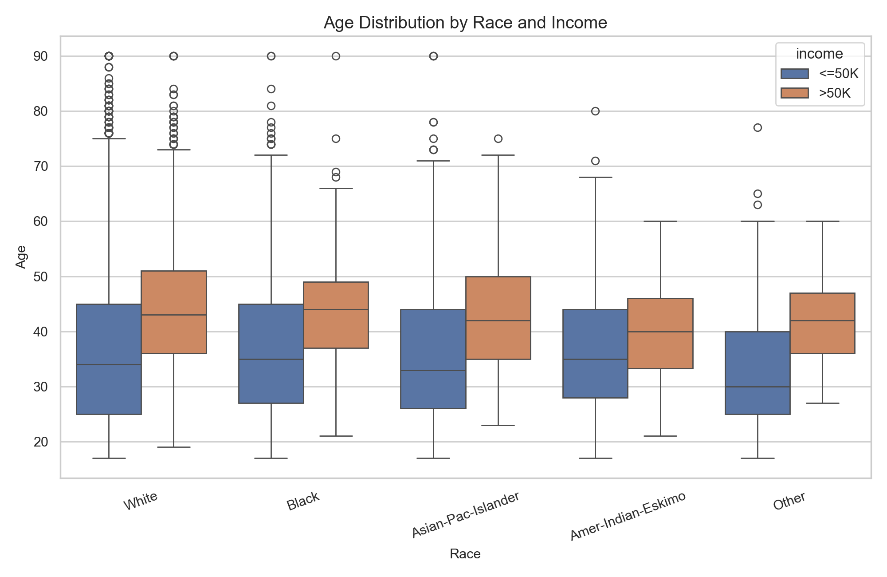
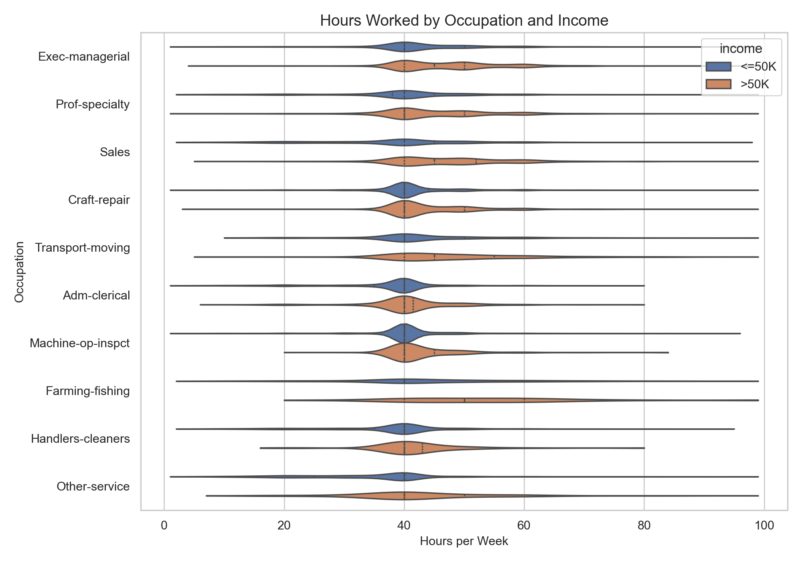
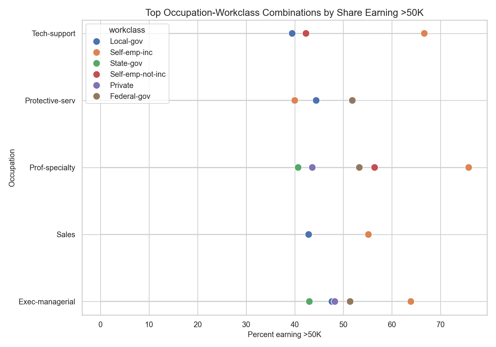
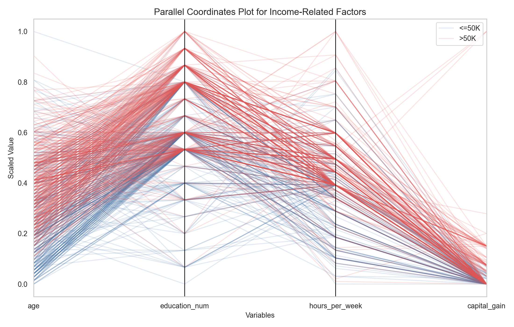

# CSE 578 Data Visualization Project

This repository contains my Arizona State University `CSE 578` course project using the Adult Census Income dataset. The project focuses on identifying and visualizing factors related to whether an individual earns more than `$50K` per year.

The work is centered on exploratory data analysis and visual storytelling for the UVW College marketing scenario from the course project prompt. It does **not** build a prediction model; instead, it produces analysis and figures that could help guide a future application.

## Project Structure

- `adult.data.txt`: raw Adult Census Income dataset
- `adult.names.txt`: dataset attribute descriptions
- `process_adult_data.py`: data cleaning pipeline
- `analyze_adult_data.py`: exploratory analysis and visualization generation
- `outputs/adult_cleaned.csv`: cleaned dataset
- `outputs/adult_cleaned_no_missing.csv`: analysis-ready dataset with incomplete rows removed
- `outputs/cleaning_summary.json`: missing-value and class-balance summary
- `outputs/eda_summary.json`: exploratory summary statistics
- `outputs/figures/`: generated project figures
- `YourName_CSE578_Course_Project_Progress_Report.docx`: milestone 1 report draft

## Dataset Cleaning

The preprocessing pipeline:

- assigns column names to the raw data
- trims whitespace from categorical values
- converts `?` to missing values
- normalizes the `income` labels
- drops `fnlwgt` based on the course guidance
- writes both a cleaned dataset and a no-missing analysis dataset

## How To Run

```bash
python3 process_adult_data.py
python3 analyze_adult_data.py
```

## Final Visualization Set

These are the main figures used in the final report.

### 1. Education vs Income

Shows the percentage of individuals earning more than `$50K` by education level.



### 2. Marital Status, Gender, and Income

Mosaic plot showing the relationship among marital status, gender, and income.



### 3. Race, Age, and Income

Box plot comparing age distributions across race groups and income categories.



### 4. Occupation, Work Hours, and Income

Violin plot showing work-hour distributions by occupation and income.



### 5. Occupation, Workclass, and Income Share

Dot plot comparing the share of individuals earning more than `$50K` across occupation and workclass combinations.



### 6. Multivariable Income Pattern Comparison

Parallel coordinates plot for age, education level, weekly work hours, capital gain, and income.



## Key Findings

- Education is one of the strongest factors related to income.
- Individuals earning `>50K` are older on average than those earning `<=50K`.
- The higher-income group also tends to work more hours per week.
- Capital gain is substantially larger in the `>50K` group.
- Multivariable analysis shows that income is better understood through combinations of factors rather than a single attribute.

## Output Files

Running the scripts produces:

- `outputs/adult_cleaned.csv`
- `outputs/adult_cleaned_no_missing.csv`
- `outputs/cleaning_summary.json`
- `outputs/eda_summary.json`
- `outputs/figures/education_vs_income.png`
- `outputs/figures/gender_marital_status_income_mosaic.png`
- `outputs/figures/race_age_income_boxplot.png`
- `outputs/figures/occupation_hours_income_violin.png`
- `outputs/figures/occupation_workclass_income_dotplot.png`
- `outputs/figures/parallel_coordinates_income_factors.png`

## Code Files

- `process_adult_data.py`: cleaning and preprocessing
- `analyze_adult_data.py`: EDA and figure generation

## Notes

- This project is visualization-focused and aligned with the course rubric.
- Prediction modeling and application development were intentionally excluded from the scope based on the course guidance and TA clarification.
